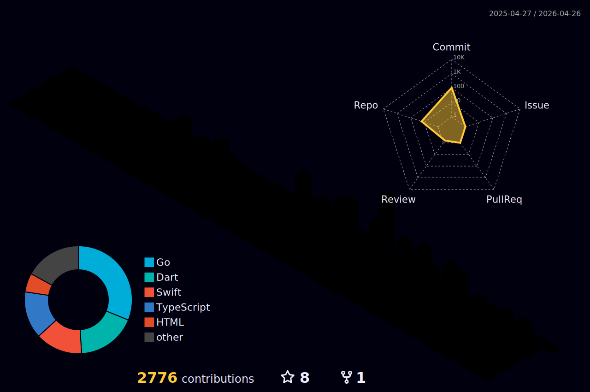

<!-- Typing Effect Header -->

  

<!-- Badge Social & Contatti -->

  
  
  
  

---

<!-- Bio Personale -->
### Hi there, you are welcome ⛩

👨‍🎓 Proud Master's Degree at **Polytechnic University of Turin**

👨‍💻 **Software Engineer** - 4.0 Industry oriented developer

🧙‍♂️ **LLM Spellcaster** - Claude, Agents, MCP, RAG enthusiast

🤖 **Prompt Engineer** - Crafting AI interactions

🖥 Unix shell advanced user

🍎 macOS evangelist

🕹 Videogames addicted

🗿 3D printer lover

🔗 Blockchain-aware

🐕🐕 Shiba Inu ♂︎ and Shiba Inu ♀︎ owner

---

<!-- Tech Stack -->
### 🛠️ Tech Stack

  <!-- Backend -->
  
   
  <!-- Frontend -->
  
   
  <!-- DevOps & Cloud -->
  
   
  <!-- Embedded & IoT -->
  
   
  <!-- 3D Printing & Blockchain -->
  
  
  
   
  <!-- AI & LLM -->
  
  
  
  
  
  

---

<!-- GitHub Streak - Fire Theme -->

  

<!-- GitHub Trophies -->

  

---

<!-- 3D Contribution Graph -->

  

<!-- Snake Animation -->

  

---

<!-- Medium Blog Posts -->
### 📝 Latest Blog Posts

<!-- BLOG-POST-LIST:START -->
- [Chi sei tu? Un viaggio tra gli identificatori digitali](https://medium.com/@cristianocavo/chi-sei-tu-un-viaggio-tra-gli-identificatori-digitali-86d1697e115b?source=rss-d17013da4ad3------2)
- [Pokemon Monogatari: nella tana del Dr. Bug](https://medium.com/@cristianocavo/pokemon-monogatari-nella-tana-del-dr-bug-ecb45e4a2f23?source=rss-d17013da4ad3------2)
- [La grande IDEa](https://medium.com/@cristianocavo/la-grande-idea-d00df0e49321?source=rss-d17013da4ad3------2)
- [“Prima pensa, poi programma”: Leslie Lamport, TLA+ e il ponte verso BFT e &lpar;crypto&rpar;-consensus](https://medium.com/@cristianocavo/prima-pensa-poi-programma-leslie-lamport-tla-e-il-ponte-verso-bft-e-crypto-consensus-5dd9db5d65cd?source=rss-d17013da4ad3------2)
- [La batteria elettrica: storia, innovazioni e curiosità da Volta ai giorni nostri](https://medium.com/@cristianocavo/la-batteria-elettrica-storia-innovazioni-e-curiosit%C3%A0-da-volta-ai-giorni-nostri-d523abe6dbda?source=rss-d17013da4ad3------2)
<!-- BLOG-POST-LIST:END -->

---

<!-- Contatore Visite -->

  

---

  

