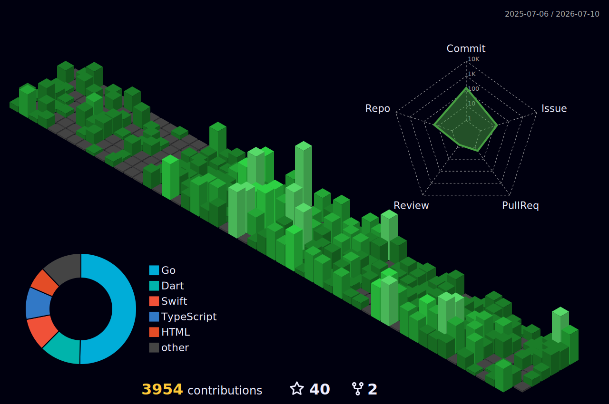

<h1 align="center">Cristiano Cavo</h1>

<strong>AI/LLM Engineer · Full-Spectrum IT Engineer</strong>

<em>M.Sc. — Polytechnic University of Turin</em>

  
  
  

## About

Software engineer in a large enterprise environment, currently delivering blockchain-based
platforms. Parallel track on **AI/LLM engineering** — agentic systems, Model Context Protocol,
retrieval-augmented generation — applied to real production workflows.

Broad, generalist profile: comfortable across backend, distributed systems, infrastructure,
tooling, and AI integration. Interested in the engineering decisions that stand behind a
working system, not the framework of the week.

## Focus

- **AI/LLM Engineering** — agent design, MCP servers, RAG pipelines, prompt engineering
- **Blockchain & Distributed Systems** — Corda R3, consensus protocols, BFT
- **System Design & Formal Methods** — architecture of distributed components, specification and verification with TLA+ and Dafny where correctness matters
- **Platform & Tooling** — developer experience, automation, Unix/shell
- **Industry 4.0** — IoT, embedded, process digitalization

## Technical Expertise

| Area | Stack |
|---|---|
| **Languages** | Java · Python · Go · TypeScript · C/C++ · Shell |
| **AI / LLM** | Claude · OpenAI · LangChain · Hugging Face · MCP · RAG |
| **Backend** | Spring · Node.js · REST · gRPC · Kafka |
| **Frontend** | React · Vue · Angular |
| **Distributed** | Corda R3 · Kafka · consensus algorithms |
| **Formal Methods** | TLA+ · Dafny · specification-driven design |
| **Cloud & DevOps** | Docker · Kubernetes · AWS · GCP · Azure · Jenkins · GitHub Actions · GitLab CI |
| **Embedded / IoT** | Arduino · Raspberry Pi · Linux |
| **Tooling** | Git · Atlassian suite · OctoPrint |

## Selected Work

- **[mcp-curator](https://github.com/strawberry-code/mcp-curator)** — Native desktop application for managing Model Context Protocol configurations in Claude Code (Go).
- **[kafka-word-splitter](https://github.com/strawberry-code/kafka-word-splitter)** — Stream-processing exercise over Kafka (Shell).
- **[claude-spooky-proxy](https://github.com/strawberry-code/claude-spooky-proxy)** — Proxy experimentation for Claude-based tooling (Go).

See pinned repositories below for the current selection.

## Writing

Long-form technical writing on [Medium](https://medium.com/@cristianocavo) — distributed
systems, cryptography, engineering method.

<!-- BLOG-POST-LIST:START -->
- [Chi sei tu? Un viaggio tra gli identificatori digitali](https://medium.com/@cristianocavo/chi-sei-tu-un-viaggio-tra-gli-identificatori-digitali-86d1697e115b?source=rss-d17013da4ad3------2)
- [Pokemon Monogatari: nella tana del Dr. Bug](https://medium.com/@cristianocavo/pokemon-monogatari-nella-tana-del-dr-bug-ecb45e4a2f23?source=rss-d17013da4ad3------2)
- [La grande IDEa](https://medium.com/@cristianocavo/la-grande-idea-d00df0e49321?source=rss-d17013da4ad3------2)
- [“Prima pensa, poi programma”: Leslie Lamport, TLA+ e il ponte verso BFT e &lpar;crypto&rpar;-consensus](https://medium.com/@cristianocavo/prima-pensa-poi-programma-leslie-lamport-tla-e-il-ponte-verso-bft-e-crypto-consensus-5dd9db5d65cd?source=rss-d17013da4ad3------2)
- [La batteria elettrica: storia, innovazioni e curiosità da Volta ai giorni nostri](https://medium.com/@cristianocavo/la-batteria-elettrica-storia-innovazioni-e-curiosit%C3%A0-da-volta-ai-giorni-nostri-d523abe6dbda?source=rss-d17013da4ad3------2)
<!-- BLOG-POST-LIST:END -->

## Contribution Activity

  

